# AM con canal AWGN — selección de SNR, Fc y fm
#### Integrantes
- Johan Sebastian Gomez Hernandez
- Johan Sebastian Gomez Hernandez
#### Presentado A:
- Prof. Ronald Zamora
#### Comunicaciones I
<H4 align="center"> Programa de Ingeniería Electrónica</H4>
<H5 align="center">Escuela de Ingenierías Eléctrica, Electrónica y de Telecomunicaciones</H5>

## Contexto Teórico:

La **modulación** es el proceso mediante el cual una señal de información, también llamada **señal moduladora**, se inserta sobre una **señal portadora** de mayor frecuencia con el fin de facilitar su transmisión por un canal de comunicación. Esta técnica es fundamental en telecomunicaciones, ya que permite adaptar señales de baja frecuencia, como voz o audio, a bandas de frecuencia adecuadas para propagación y transmisión eficiente.

### Modulación en Amplitud (AM)

En la modulación AM, la **amplitud de la portadora** varía de acuerdo con la señal de información, mientras que su frecuencia y fase permanecen constantes. Matemáticamente, una señal AM puede expresarse como:
$$
s(t) = (A_c + m(t)) \cos(2 \pi f_c t)
$$
Donde:
- $A_c$​: amplitud de la portadora.
- $f_c$​: frecuencia de la portadora.
- $m(t)$: señal moduladora (información).

Si la señal moduladora es una onda senoidal:

$$
m(t) = A_m \cos(2\pi f_m t)
$$

con $A_m$ la amplitud del mensaje y $f_m$ su frecuencia, la señal AM queda:

$$
s(t) = A_c \cos(2\pi f_c t) + A_m \cos(2\pi f_m t)\cos(2\pi f_c t)
$$

Aplicando la identidad trigonométrica de producto a suma:

$$
\cos(2\pi f_m t)\cos(2\pi f_c t) = \tfrac{1}{2}\Big[\cos\big(2\pi(f_c+f_m)t\big) + \cos\big(2\pi(f_c-f_m)t\big)\Big]
$$

La señal modulada puede escribirse como:

$$
s(t) = A_c \cos(2\pi f_c t) + \tfrac{A_m}{2}\cos\big(2\pi(f_c+f_m)t\big) + \tfrac{A_m}{2}\cos\big(2\pi(f_c-f_m)t\big)
$$

La señal AM contiene tres componentes espectrales:

1. La **portadora** en $f_c$.  
2. La **banda lateral superior** en $f_c + f_m$.  
3. La **banda lateral inferior** en $f_c - f_m$.  

El **ancho de banda** total de la señal AM es:

$$
B = 2 f_m
$$

donde $f_m$ es la frecuencia máxima del mensaje.
### Señal Portadora y Señal Moduladora
- **Frecuencia Portadora ($f_c$)**: es una onda de alta frecuencia que actúa como vehículo de transmisión. En este proyecto se considera un rango entre 100 kHz y 200 kHz.
- **Frecuencia Moduladora $(f_m​)$**: corresponde a la señal de información, en este caso una onda senoidal, con un rango de 1 kHz a 10 kHz. Este rango representa señales de voz o audio de baja frecuencia.

La relación entre ambas frecuencias cumple que $f_c≫f_m​$, lo cual garantiza que la portadora pueda transportar adecuadamente a la moduladora sin solapamiento espectral.

### Relación Señal-Ruido (SNR)

En un canal de comunicación, la señal se ve afectada por ruido. La calidad de la transmisión se evalúa mediante la **relación señal a ruido** o **SNR (Signal-to-Noise Ratio)**, definida como:

$$SNR= \frac{P_{\text{señal}}}{P_{\text{ruido}}} [\frac{W}{W}]$$

en dB:

$$SNR(dB) = 10 \cdot \log_{10}\left(\frac{P_{\text{señal}}}{P_{\text{ruido}}}\right) [dB]$$

Un SNR alto indica que la señal se recibe con buena calidad, mientras que un SNR bajo implica que el ruido interfiere considerablemente con la información transmitida. En la simulación realizada en MATLAB, el valor de SNR se puede seleccionar para observar cómo cambia la fidelidad de la señal demodulada. 

## Procedimiento:

La simulación consiste en generar una **señal senoidal moduladora**, seleccionando valores de **$f_c$, $f_m$ y SNR**, para luego aplicar modulación AM. Posteriormente, se analiza el espectro de la señal original, de la modulada y de la demodulada, mostrando cómo influyen estos parámetros en la calidad de transmisión. MATLAB permite incluir ruido aditivo gaussiano blanco (AWGN) en el canal, lo cual facilita observar el impacto del SNR en la recuperación de la señal. 

Se consiguieron los siguientes resultados:

| $$\text{Prueba}$$ | $$SNR[dB]$$ | $$f_c[kHz]$$ | $$f_m[kHz]$$ |
| ----------------- | ----------- | ------------ | ------------ |
| 01                | 30          | 180          | 5            |
| 02                | 95          | 200          | 2            |
| 03                | 50          | 100          | 5            |
| 04                | 15          | 20           | 9            |
| 05                | 10          | 150          | 1            |
| 06                | 5           | 200          | 10           |
| 07                | 8           | 200          | 4            |
| 08                | 75          | 175          | 2            |
| 09                | 95          | 160          | 3            |
| 10                | 10          | 100          | 8            |
| 11                | 20          | 75           | 9            |
| 12                | 35          | 125          | 6            |

  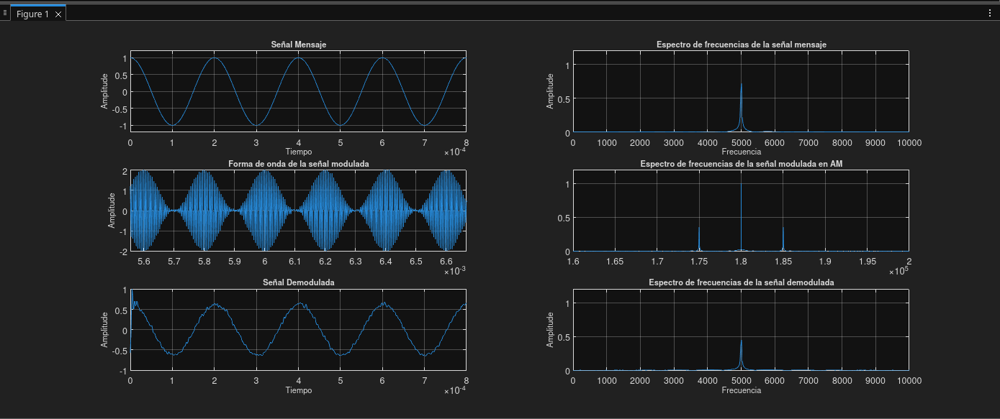
  
Prueba 01

  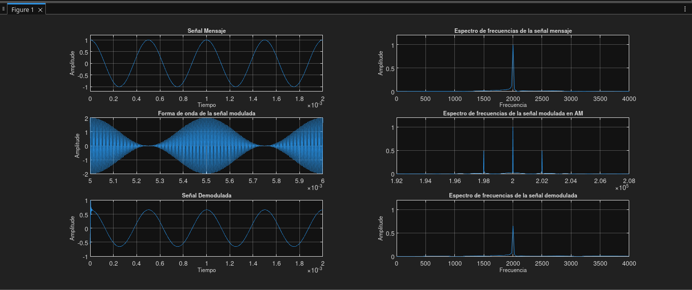
  
Prueba 02

  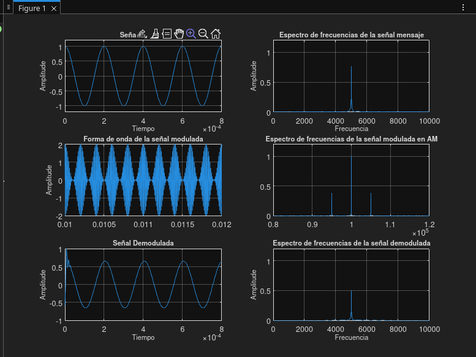
  
Prueba 03

  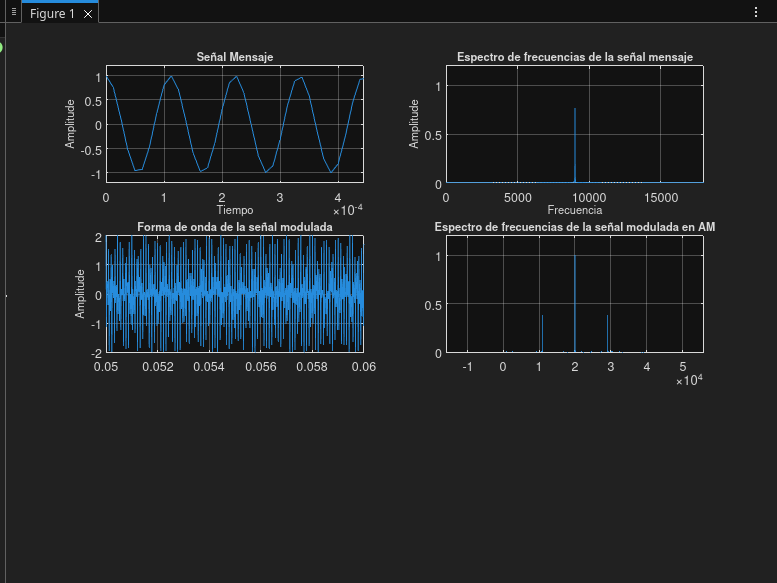
  
Prueba 04

  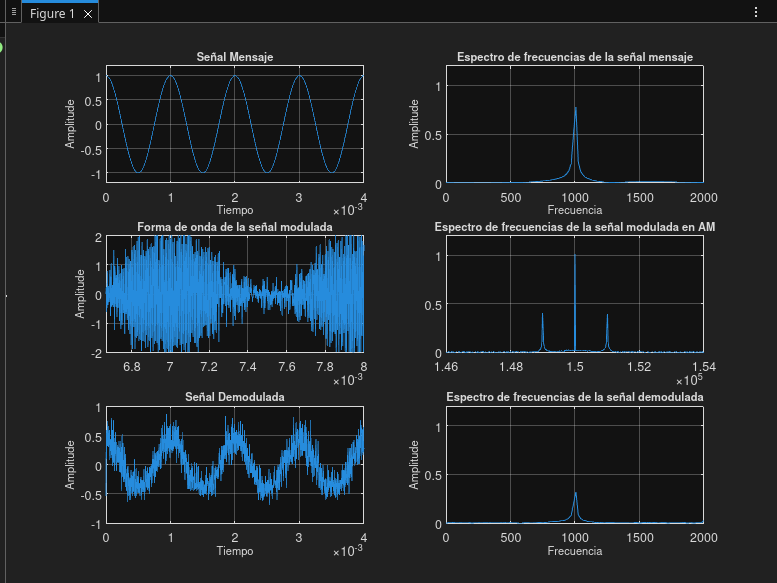
  
Prueba 05

  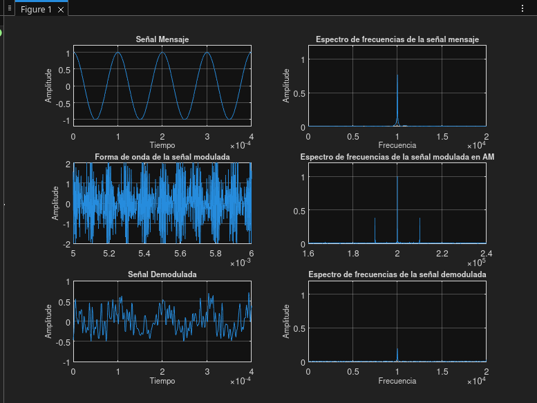
  
Prueba 06

  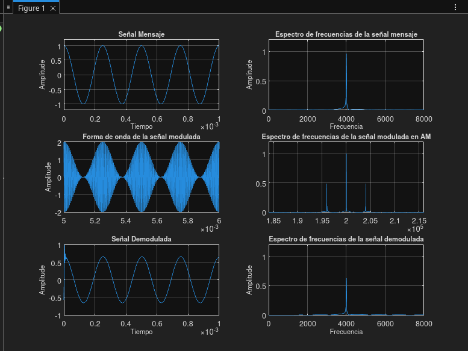
  
Prueba 07

  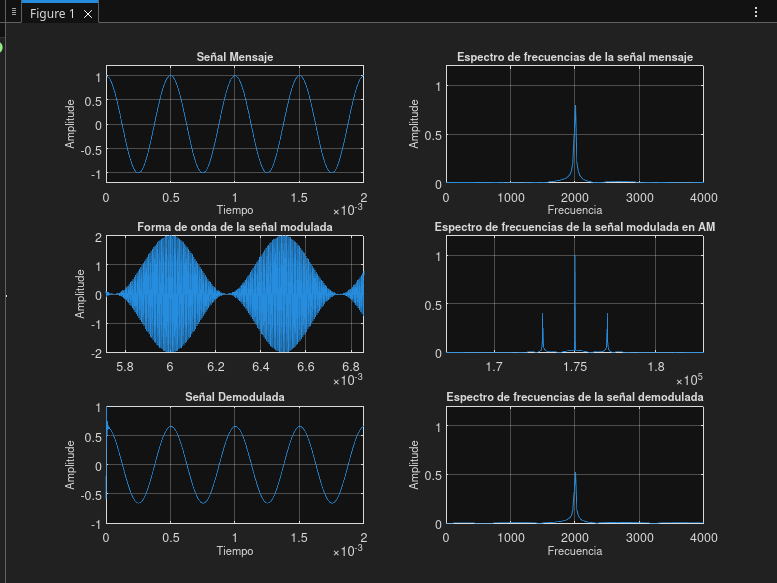
  
Prueba 08

  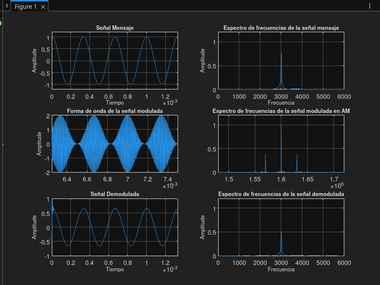
  
Prueba 09

  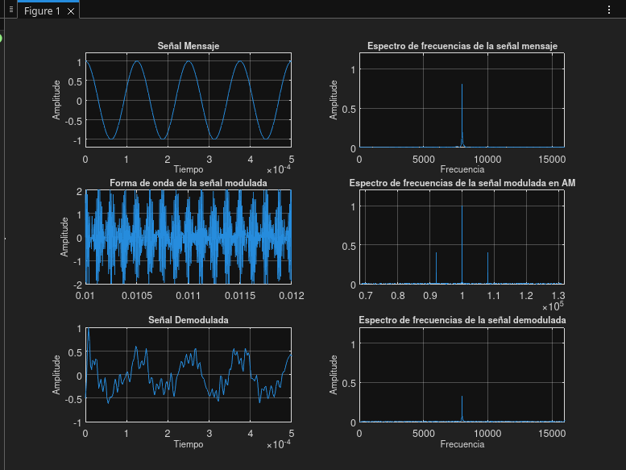
  
Prueba 10

  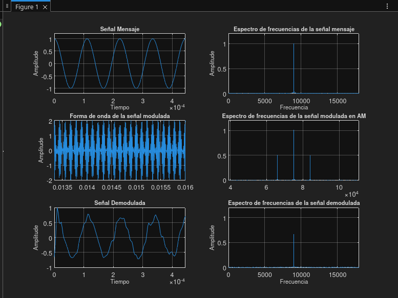
  
Prueba 11

  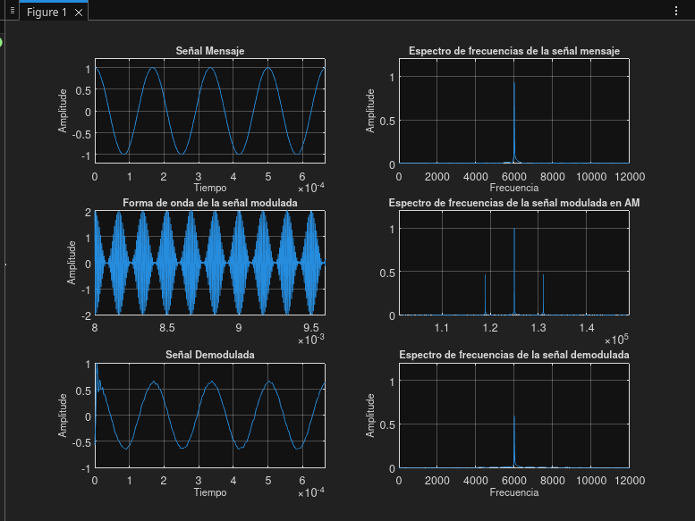
  
Prueba 12

## Conclusiones:

## Referencias:

