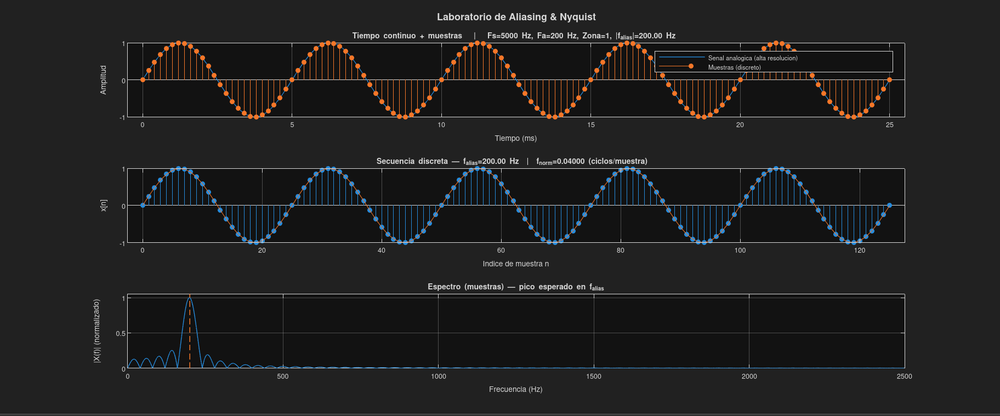
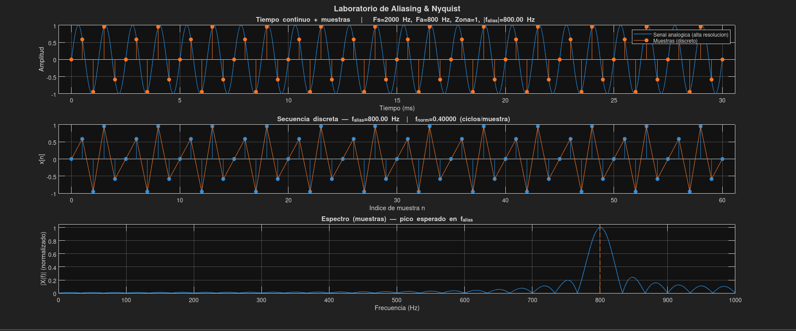
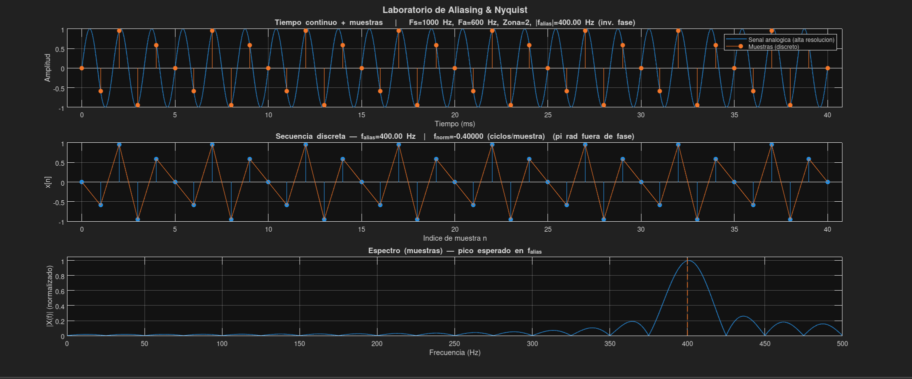
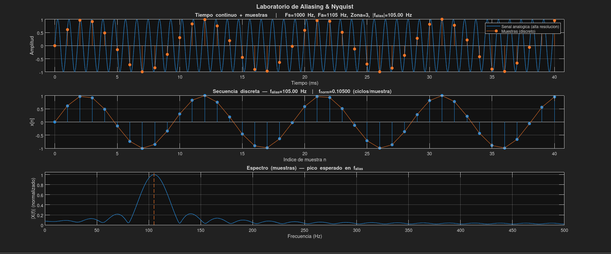
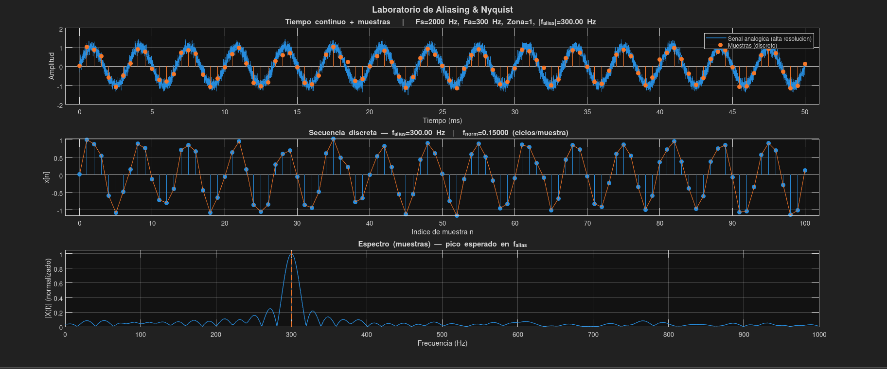
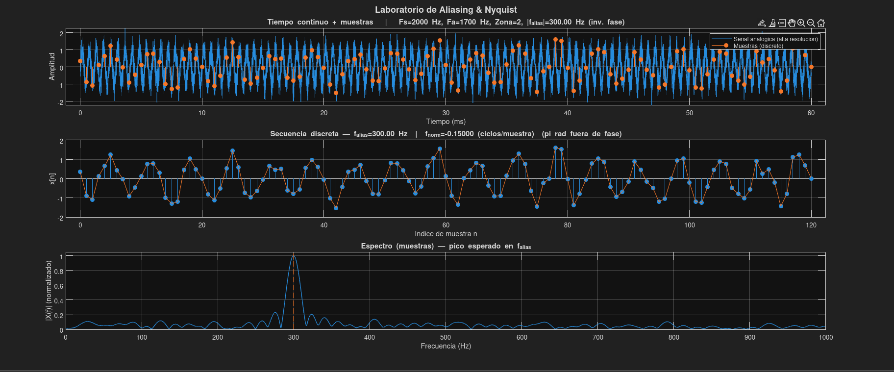
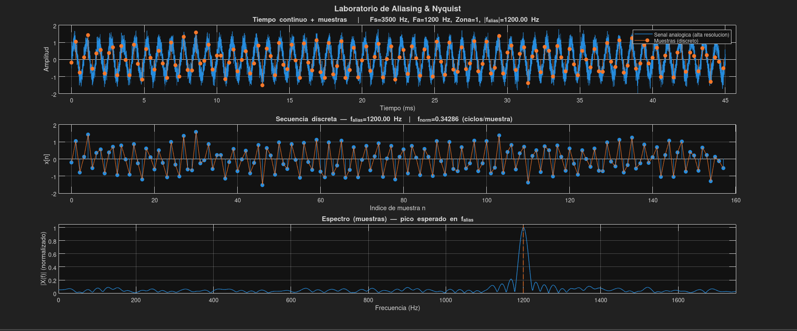
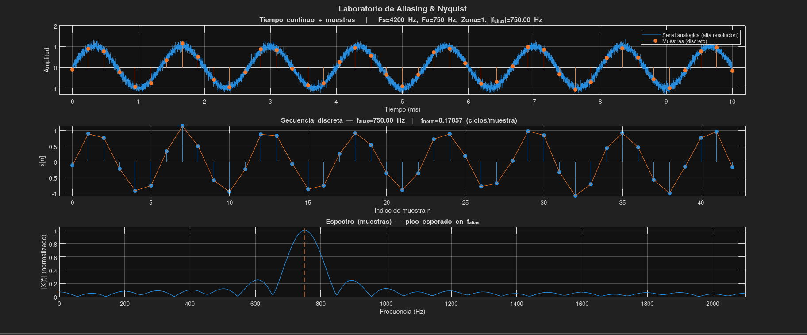
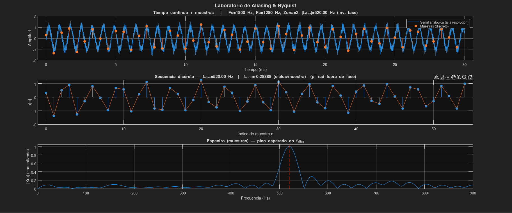
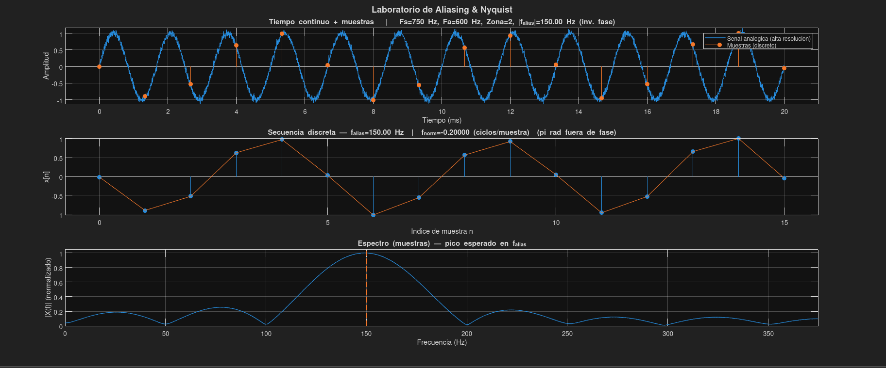

# Aliasing, Zonas de Nyquist y Efecto del Ruido
#### Integrantes
- Johan Sebastian Gomez Hernandez
- Javier Sneyder Gomez Suarez
#### Presentado A:
- Prof. Ronald Zamora
##### Declaración de Originalidad:
**Se utilizó el modelo LLM de x.ai, grok-4 para reformular secciones del informe y verificar gramática, pero el contenido técnico fue desarrollado y supervisado completamente por los autores.**
#### Comunicaciones I
<H4 align="center"> Programa de Ingeniería Electrónica</H4>
<H5 align="center">Escuela de Ingenierías Eléctrica, Electrónica y de Telecomunicaciones</H5>

---
## Contexto Teórico:

La **modulación** es el proceso mediante el cual una señal de información, también llamada **señal moduladora**, se inserta sobre una **señal portadora** de mayor frecuencia con el fin de facilitar su transmisión por un canal de comunicación. Esta técnica es fundamental en telecomunicaciones, ya que permite adaptar señales de baja frecuencia, como voz o audio, a bandas de frecuencia adecuadas para propagación y transmisión eficiente. Este fenómeno resulta tan versátil que se puede llegar a identificar especies de aves por el tipo modulación que tienen sus sonidos en la naturaleza. [1].
### Modulación en Amplitud (AM)

En la modulación AM, la **amplitud de la portadora** varía de acuerdo con la señal de información, mientras que su frecuencia y fase permanecen constantes. Matemáticamente, una señal AM puede expresarse como:
$$
s(t) = (A_c + m(t)) \cos(2 \pi f_c t)
$$
Donde:
- $A_c$​: amplitud de la portadora.
- $f_c$​: frecuencia de la portadora.
- $m(t)$: señal moduladora (información).

Si la señal moduladora es una onda senoidal:

$$
m(t) = A_m \cos(2\pi f_m t)
$$

con $A_m$ la amplitud del mensaje y $f_m$ su frecuencia, la señal AM queda:

$$
s(t) = A_c \cos(2\pi f_c t) + A_m \cos(2\pi f_m t)\cos(2\pi f_c t)
$$

Aplicando la identidad trigonométrica de producto a suma:

$$
\cos(2\pi f_m t)\cos(2\pi f_c t) = \tfrac{1}{2}\Big[\cos\big(2\pi(f_c+f_m)t\big) + \cos\big(2\pi(f_c-f_m)t\big)\Big]
$$

La señal modulada puede escribirse como:

$$
s(t) = A_c \cos(2\pi f_c t) + \tfrac{A_m}{2}\cos\big(2\pi(f_c+f_m)t\big) + \tfrac{A_m}{2}\cos\big(2\pi(f_c-f_m)t\big)
$$
La señal AM contiene tres componentes espectrales:

1. La **portadora** en $f_c$.  
2. La **banda lateral superior** en $f_c + f_m$.  
3. La **banda lateral inferior** en $f_c - f_m$.  

El **ancho de banda** total de la señal AM es:

$$
B = 2 f_m
$$

donde $f_m$ es la frecuencia máxima del mensaje.[2].
### Señal Portadora y Señal Moduladora
- **Frecuencia Portadora ($f_c$)**: es una onda de alta frecuencia que actúa como vehículo de transmisión. En este proyecto se considera un rango entre 100 kHz y 200 kHz.
- **Frecuencia Moduladora $(f_m​)$**: corresponde a la señal de información, en este caso una onda senoidal, con un rango de 1 kHz a 10 kHz. Este rango representa señales de voz o audio de baja frecuencia.

La relación entre ambas frecuencias cumple que $f_c≫f_m​$, lo cual garantiza que la portadora pueda transportar adecuadamente a la moduladora sin solapamiento espectral.

### Relación Señal-Ruido (SNR)

En un canal de comunicación, la señal se ve afectada por ruido. La calidad de la transmisión se evalúa mediante la **relación señal a ruido** o **SNR (Signal-to-Noise Ratio)**, definida como:

$$SNR= \frac{P_{\text{señal}}}{P_{\text{ruido}}} [\frac{W}{W}]$$
en dB:
$$SNR(dB) = 10 \cdot \log_{10}\left(\frac{P_{\text{señal}}}{P_{\text{ruido}}}\right) [dB]$$
Un SNR alto indica que la señal se recibe con buena calidad, mientras que un SNR bajo implica que el ruido interfiere considerablemente con la información transmitida.

### Canal AWGN

Un **canal AWGN (*Additive White Gaussian Noise*)** es un modelo de canal utilizado para representar el efecto del ruido sobre la señal transmitida.[3],[4].
#### Características
1. **Aditivo:** El ruido se suma a la señal transmitida.  
2. **Blanco (White):** Todas las frecuencias tienen igual densidad espectral de potencia, es decir, el ruido es *flat* en frecuencia.  
3. **Gaussiano:** La amplitud del ruido sigue una distribución normal:

$$
n(t) \sim \mathcal{N}(0, \sigma^2)
$$

donde $\sigma^2$ es la varianza del ruido.
Si la señal transmitida es $s(t)$, la señal recibida $r(t)$ se modela como:

$$
r(t) = s(t) + n(t)
$$

Este modelo permite **analizar la relación señal-ruido (SNR), probabilidad de error y desempeño de sistemas de comunicación** en condiciones realistas.

---
## Procedimiento:

La simulación consiste en generar una **señal senoidal moduladora**, seleccionando valores de **$f_c$, $f_m$ y SNR**, para luego aplicar modulación AM. Posteriormente, se analiza el espectro de la señal original, de la modulada y de la demodulada, mostrando cómo influyen estos parámetros en la calidad de transmisión. MATLAB permite incluir ruido aditivo gaussiano blanco en el canal, lo cual facilita observar el impacto del SNR en la recuperación de la señal. En la simulación realizada.

Se consiguieron los siguientes resultados:

| Prueba | FM[kHz] | FA[kHz] | n |  m |
|:------:|:-------:|:-------------------:|:------------------:|:------------------:|
|  01    |   5000  |       200           |        25          |         256        |
|  02    |   95    |        200          |         2          |         256        |
|  03    |   50    |        100          |         5          |         256        |
|  04    |   15    |        120          |         9          |         256        |
|  05    |   10    |        150          |         1          |         256        |
|  06    |    5    |        200          |        10          |         256        |
|  07    |    8    |        200          |         4          |         256        |
|  08    |   75    |        175          |         2          |         256        |
|  09    |   95    |        160          |         3          |         256        |
|  10    |   10    |        100          |         8          |         256        |

Prueba 01

Se puede observar como el ancho de banda $B=10[kHz]$ cumple con los valores teóricos, además de recibir una señal demodulada con un 60% de la amplitud de la onda original, con ligeras distorsiones debido a la relación SNR media.

Prueba 02

Con un ancho de banda $B=4[kHz]$, cumple con los valores teóricos, la señal demodulada con un 65% de la amplitud de la onda original, con ligeras pero sin distorsiones significativas debido a la relación SNR alta.

Prueba 03

Ancho de banda $B=10[kHz]$, además de recibir una señal demodulada con un 60% de la amplitud de la onda original, con una ligera distorsión al inicio. Relacion SNR media.

Prueba 04

Ancho de banda $B=18[kHz]$, la señal demodulada con menos del 60% de la amplitud de la onda original, una notable distorsión debido la relación SNR baja.

Prueba 05

Ancho de banda $B=2[kHz]$, además de recibir una señal demodulada con una amplitud inestable, la relación SNR es muy baja.

Prueba 06

Ancho de banda $B=20[kHz]$, cumple con los valores teóricos, además de recibir una señal demodulada con una amplitud inestable, la relación SNR es muy baja.

Prueba 07

Se puede observar como el ancho de banda $B=8[kHz]$, además de recibir una señal demodulada con una amplitud inestable, la relación SNR es muy baja.

Prueba 08

Se puede observar como el ancho de banda $B=4[kHz]$, además de recibir una señal demodulada algo mayor a un 60% de la amplitud de la onda original, sin distorsiones relevantes debido a la relación SNR alta.

Prueba 09

Se puede observar como el ancho de banda $B=6[kHz]$, recibe una señal demodulada algo mayor a un 60% de la amplitud de la onda original, sin distorsiones relevantes debido a la relación SNR alta.

Prueba 10

Se puede observar como el ancho de banda $B=16[kHz]$, recibe una señal demodulada con una amplitud inestable pero mantiene algo de su forma original, la relación SNR es muy baja.

Prueba 11

Ancho de banda $B=18[kHz]$, recibe una señal demodulada con un 60% de la amplitud de la onda original, presenta algo de distorsión sin comprometer significativamente su forma. una relación SNR media.

Prueba 12

Ancho de banda $B=12[kHz]$, además de recibir una señal demodulada con un 60% de la amplitud de la onda original, con mínimas distorsiones debido la relación SNR media.

---
## Conclusiones:

Sintetizando todo lo anterior se pudo llegar a lo siguiente:

Las simulaciones realizadas en esta practica demuestran de manera efectiva los principios fundamentales de la modulación en amplitud (**AM**) en un canal **AWGN**, destacando el impacto de los parámetros **SNR**, frecuencia portadora ($f_c$) y frecuencia moduladora ($f_m$) en la calidad de la transmisión y recuperación de la señal.

Se evidencia que un **SNR** elevado (por ejemplo, en las pruebas **02**, **08** y **09**, con valores de $95[dB]$ y $75 [dB]$) permite una demodulación precisa, donde la señal recuperada mantiene una alta similitud con el mensaje original tanto en el dominio del tiempo como en el espectro de frecuencia. En estos casos, el ruido tiene un efecto mínimo, lo que resulta en envolventes claras en la señal modulada y picos espectrales bien definidos, confirmando la teoría de que un **SNR** superior a $30[dB]$ asegura una transmisión de buena calidad para aplicaciones como audio o voz.

En pruebas con **SNR** bajo (como las **05**, **06** y **07**, con $10 [dB]$, $5 [dB]$ y $8 [dB]$ respectivamente), el ruido interfiere significativamente, distorsionando la señal demodulada con fluctuaciones aleatorias y ampliando el espectro de frecuencia, lo que dificulta la recuperación del mensaje. Esto ilustra cómo el **AWGN** modela condiciones realistas de canales de comunicación, donde factores ambientales como atenuación, interferencias y reflexiones provocan una inevitable pérdida de amplitud y potencia en la señal transmitida, tal como se observa en las gráficas de las pruebas con bajo **SNR**.

La selección de $f_c$ (entre 100 kHz y 200 kHz) y $f_m$ (entre 1 kHz y 10 kHz) valida la condición $fc ≫ fm$, evitando solapamientos espectrales y asegurando un ancho de banda total de $B=2\cdot fm$, como se describe en la teoría. En pruebas con $f_m$ alta (por ejemplo, 10 kHz en la prueba **06**), el espectro de la señal modulada se expande, incrementando la susceptibilidad al ruido, mientras que valores bajos de $f_m$ facilitan una transmisión más estable.

---
## Referencias:
[1] Rutter, A. R., Fuxjager, M. J., & Roberts, T. J. (2025). Relative amplitude modulation in woodpecker drums shows species-specific patterns. _Animal Behaviour, 225,_ 123206. [https://doi.org/10.1016/j.anbehav.2025.123206](https://doi.org/10.1016/j.anbehav.2025.123206)
[2] L. Vaishnavi D. A. y A. C. Kumar, “Evaluating Supervised Learning Classifier Performance for OFDM Communication in AWGN-Impacted Systems,” _Results in Engineering_, vol. 26, p. 105178, 2025. doi: 10.1016/j.rineng.2025.105178.
[3] Chen, Y., Hu, Z., Zhao, J., Li, F., Zhu, H., & Xiao, J. (2025). Three dimensional amplitude modulation and demodulation technology based on independent dual sideband optical communication system. _Optics Communications, 583,_ 131791. [https://doi.org/10.1016/j.optcom.2025.131791](https://doi.org/10.1016/j.optcom.2025.131791)
[4] H. Kostadinov and N. L. Manev, “Symbol and bit error probability for coded TQAM in AWGN channel,” _Procedia Computer Science_, vol. 108, pp. 2110–2118, 2017, doi: 10.1016/j.procs.2017.05.205.
