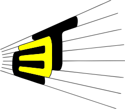

# Aliasing, Zonas de Nyquist y Efecto del Ruido
#### Integrantes
- Johan Sebastian Gomez Hernandez
- Javier Sneyder Gomez Suarez
#### Presentado A:
- Prof. Ronald Zamora
##### Declaración de Originalidad:
**Se utilizó el modelo LLM de x.ai, grok-4 para reformular secciones del informe y verificar gramática, pero el contenido técnico fue desarrollado y supervisado completamente por los autores.**
#### Comunicaciones I
<H4 align="center"> Programa de Ingeniería Electrónica</H4>
<H5 align="center">Escuela de Ingenierías Eléctrica, Electrónica y de Telecomunicaciones</H5>

---
## Contexto Teórico:

---
## Procedimiento:

Se consiguieron los siguientes resultados:

| Prueba | Fs \[Hz] | Fa \[Hz] | Duración \[ms] | Puntos entre muestras | Nivel ruido |
| :----: | :------: | :------: | :------------: | :-------------------: | :---------: |
|   01   |   5000   |    200   |       25       |          256          |      0      |
|   02   |   2000   |    800   |       30       |          256          |      0      |
|   03   |   1000   |    600   |       40       |          256          |      0      |
|   04   |   1000   |   1105   |       40       |          256          |      0      |
|   05   |   2000   |    300   |       50       |          128          |     0.15    |
|   06   |   2000   |   1700   |       60       |          128          |     0.35    |
|   07   |   3500   |   1200   |       45       |          128          |     0.25    |
|   08   |   4200   |    750   |       10       |          256          |     0.10    |
|   09   |   1800   |   1280   |       30       |          128          |     0.20    |
|   10   |    750   |    600   |       20       |          256          |     0.05    |

Prueba 01

Dado que la señal está en la zona de Nyquist $f_S >> f_a$ la señal muestreada se verá como una representación precisa de la señal original.

Prueba 02

XEX

Prueba 03

TXEX

Prueba 04

TXEX

Prueba 05

TXEX

Prueba 06

TXEX

Prueba 07

TXEX

Prueba 08

TXEX

Prueba 09

TXEX

Prueba 10

TXEX

Prueba 11

TXEX

Prueba 12

TXEX

---
## Conclusiones:

Sintetizando todo lo anterior se pudo llegar a lo siguiente:

---
## Referencias:
[1] Rutter, A. R., Fuxjager, M. J., & Roberts, T. J. (2025). Relative amplitude modulation in woodpecker drums shows species-specific patterns. _Animal Behaviour, 225,_ 123206. [https://doi.org/10.1016/j.anbehav.2025.123206](https://doi.org/10.1016/j.anbehav.2025.123206)
[2] L. Vaishnavi D. A. y A. C. Kumar, “Evaluating Supervised Learning Classifier Performance for OFDM Communication in AWGN-Impacted Systems,” _Results in Engineering_, vol. 26, p. 105178, 2025. doi: 10.1016/j.rineng.2025.105178.
[3] Chen, Y., Hu, Z., Zhao, J., Li, F., Zhu, H., & Xiao, J. (2025). Three dimensional amplitude modulation and demodulation technology based on independent dual sideband optical communication system. _Optics Communications, 583,_ 131791. [https://doi.org/10.1016/j.optcom.2025.131791](https://doi.org/10.1016/j.optcom.2025.131791)
[4] H. Kostadinov and N. L. Manev, “Symbol and bit error probability for coded TQAM in AWGN channel,” _Procedia Computer Science_, vol. 108, pp. 2110–2118, 2017, doi: 10.1016/j.procs.2017.05.205.
